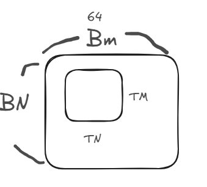

# Day 10 — Kernel 9 Autotuning 紀錄

> 針對 **SGEMM Kernel 9** 進行參數掃描與程式碼動線剖析，以下整理為易讀格式，方便後續調參或加速。

---

## 1 參數掃描腳本
 - 
```bash
# kernel9_tune.sh — 逐一替換巨集、重新編譯、量測效能
BK_VALUES=(8 16 32 64)
TM_VALUES=(4 8 16 32)
TN_VALUES=(4 8 16 32)
BM_VALUES=(64 128 256)
BN_VALUES=(64 128 256)
NUM_THREADS_VALUES=(256)

for bk in ${BK_VALUES[@]}; do
  for tm in ${TM_VALUES[@]}; do
    for tn in ${TN_VALUES[@]}; do
      for bm in ${BM_VALUES[@]}; do
        for bn in ${BN_VALUES[@]}; do
          for nt in ${NUM_THREADS_VALUES[@]}; do
            sed -i "s/const uint K9_BK = .*/const uint K9_BK = $bk;/"     $RUNNER
            sed -i "s/const uint K9_TM = .*/const uint K9_TM = $tm;/"     $RUNNER
            sed -i "s/const uint K9_TN = .*/const uint K9_TN = $tn;/"     $RUNNER
            sed -i "s/const uint K9_BM = .*/const uint K9_BM = $bm;/"     $RUNNER
            sed -i "s/const uint K9_BN = .*/const uint K9_BN = $bn;/"     $RUNNER
            sed -i "s/const int  K9_NUM_THREADS = .*/const int K9_NUM_THREADS = $nt;/" $KERNEL

            nvcc -O3 -arch=sm_61 -lcublas -I ../src/ \
                 ../src/runner.cu ../sgemm.cu -o sgemm
            # ./sgemm <args> → 這裡可接 Nsight Compute/自訂計時器
          done
        done
      done
    done
  done
done
```

* **思路**：利用 `sed` 即時覆寫巨集，重新 `nvcc` 編譯並執行量測。
* **後續**：可將結果用 `csv` 紀錄，配合 Python 畫 heat‑map 尋找最佳組合。

---

## 2 Warp‑Tile 為何能提速？

| 無 Warp‑tile                                    | 有 Warp‑tile（本 kernel）                            |
| ---------------------------------------------- | ------------------------------------------------ |
| 256 threads 全靠 `__syncthreads()`，每做一次 dot 就得等待 | 每個 warp（32 threads）獨立計算 64 × 64 子塊，warp 內 0 sync |
| 記憶體存取跨行跨列，易產生 bank conflict                    | 16 threads 同行 vector 讀 `float4`，完美 coalesced     |
| `threadResults` 需容納整個 block，寄存器壓力大             | 只存各自 warp‑tile，小而精，寄存器使用低                        |
| Block‑size 變大時 sync 開銷急升                       | 透過 `WMITER/WNITER` 彈性掃描，scale 良好                 |

> **Warp‑tile 概念**：`warpSize = 32` ⇒ 將 warp 排成 *2 row × 16 col*，對應 64 × 64 矩陣；每列 16 threads 同步讀一條 `float4`（128 bit），既對齊又避免 bank conflict。

---

## 3 Kernel 9 執行流程

```txt
for bkIdx           // K 軸分塊 (BK)
 ├─ Load A_block (BM×BK, 轉置) → As
 ├─ Load B_block (BK×BN)       → Bs
 ├─ __syncthreads()
 ├─ for wmIdx, wnIdx           // warp‑tile 掃描
 │    ├─ for dotIdx < BK
 │    │    ├─ regM ← As
 │    │    ├─ regN ← Bs
 │    │    └─ threadResults += regM × regN
 ├─ __syncthreads()
 └─ A += BK;  B += BK*N        // 移至下一塊 K‑tile
```

### 3.1 索引對應

| 變數                 | 含義                                         |            |
| ------------------ | ------------------------------------------ | ---------- |
| `cRow`, `cCol`     | 目前 block 在 C 的 (blockY, blockX)            |            |
| `threadRow/Col`    | warp 內 (row, col) 位置 = `threadIdx.x /% 16` |            |
| `innerRowA/ColA`   | 此 thread 載入 A\_block 時對應 (row, col/4)      |            |
| `rowStrideA/B`     | 下一次 offset 跨幾列，確保 256 threads 填滿 BM/BK     |            |
| `WM`, `WN`         | Warp‑tile 尺寸 = (WM= TM *16, WN= TN * 16)                       |  |
| `WMITER`, `WNITER` | Block‑tile 被同一 warp 掃過的次數                  |            |

---

## 4 關鍵程式片段

### 4.1 共享記憶體載入 & 轉置

```cpp
float4 tmp = *(float4*)&A[(innerRowA+offset)*K + innerColA*4];
As[(innerColA*4+0)*BM + innerRowA+offset] = tmp.x;
As[(innerColA*4+1)*BM + innerRowA+offset] = tmp.y;
As[(innerColA*4+2)*BM + innerRowA+offset] = tmp.z;
As[(innerColA*4+3)*BM + innerRowA+offset] = tmp.w;
```

* Column‑major 儲存法可讓 `dotIdx` 乃連續 index；降低 bank conflict。

### 4.2 FMA 累積到暫存器

```cpp
for (dotIdx=0; dotIdx<BK; ++dotIdx) {
  regM[i] = As[dotIdx*BM + row];
  regN[i] = Bs[dotIdx*BN + col];
  threadResults[idx] += regM * regN; // TM×TN 次 FMA
}
```

---

## 5 實務提醒

1. **向量化寬度**：若 GPU 僅有 64 bit LDG，可把 `float4→float2` 再 tune。
2. **BK 大小**：太大佔 SMEM，太小則 DRAM 往返頻繁，需配合卡片 L1/SMEM 容量測試。
3. **Occupancy vs. ILP**：高寄存器 kernel 建議 `__launch_bounds__()` 綁定 thread/block，避免編譯器過度發 register。

---

### ✨ 結論

*Warp‑tile + 向量化* = 【**減 sync** ＋ **減 DRAM 指令**】，再搭配 auto‑tune 找到 BM/BN/BK/TM/TN 最佳 sweet‑spot，可在 Ampere+ GPU 上逼近 cublas SGEMM 的 90 % 峰值。


