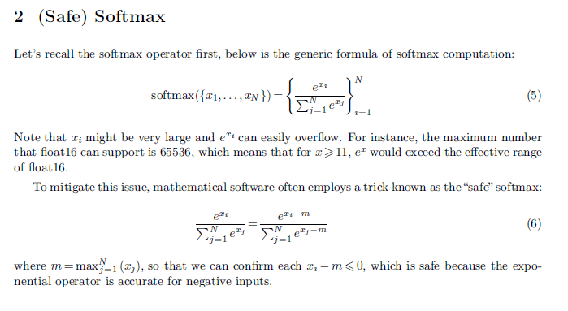
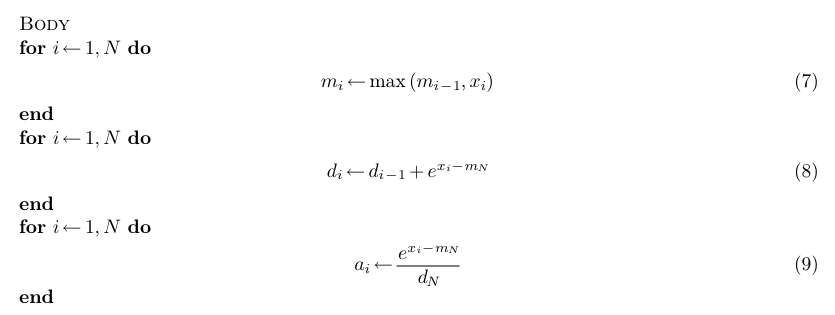
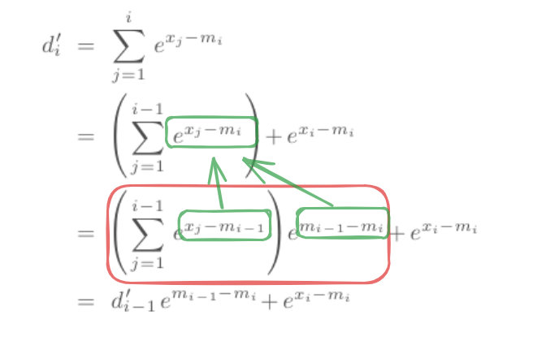
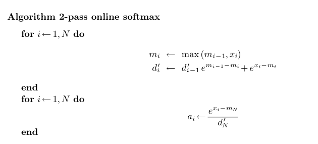
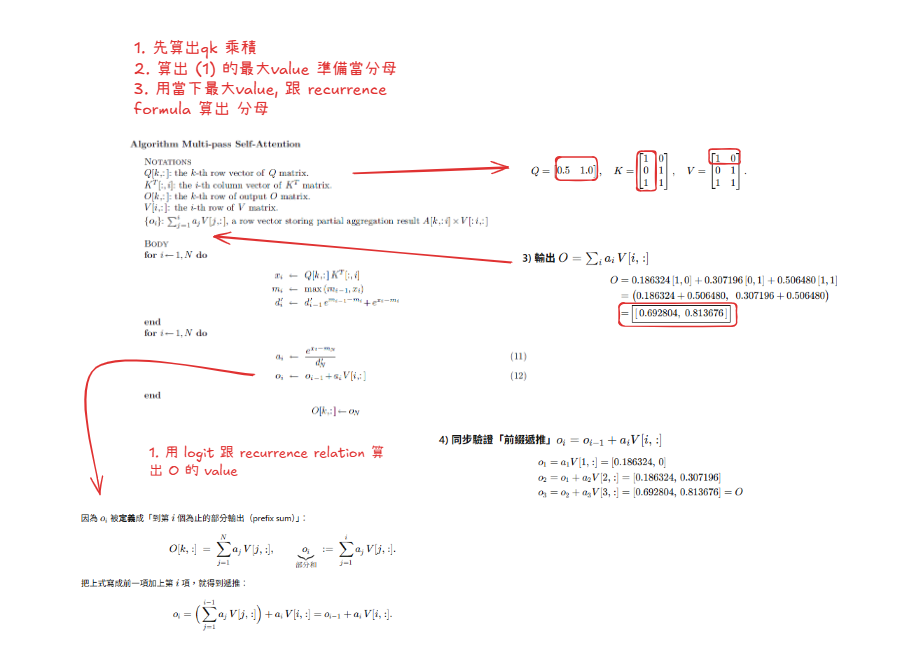
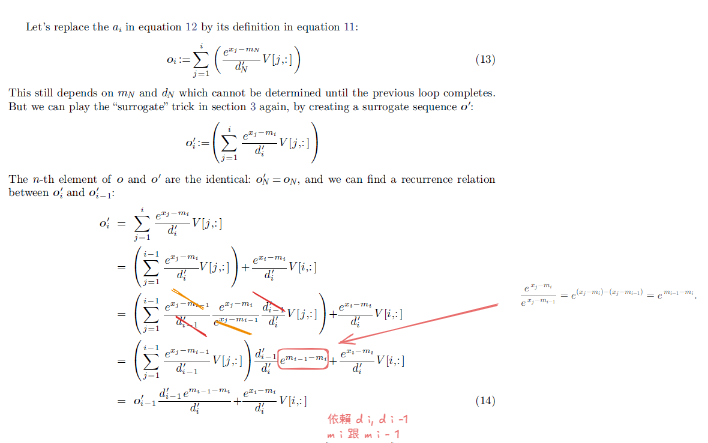
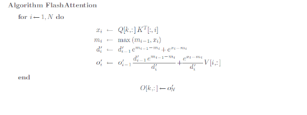
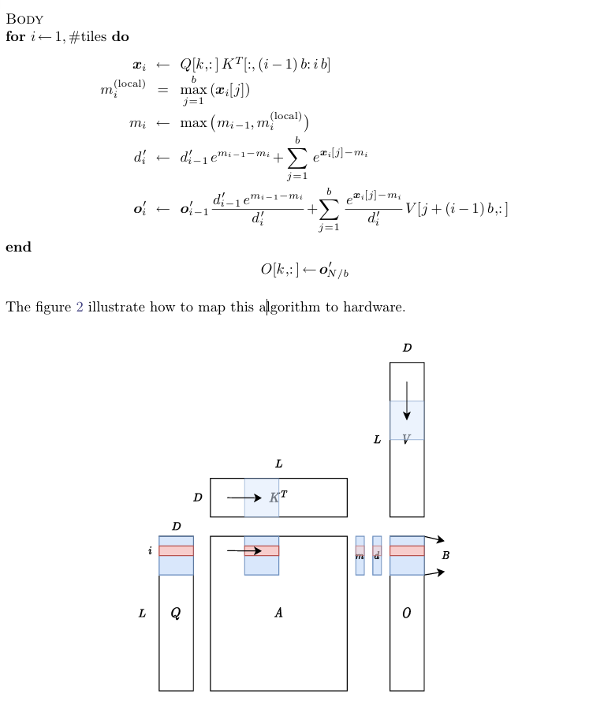

# Objectives
- Understand the concept of flash attention and its significance in deep learning.
https://courses.cs.washington.edu/courses/cse599m/23sp/notes/flashattn.pdf
# reade above material and understand the formulas. 
- safesoftmax: 

    - prevent overflow and underflow in softmax computation.
    - find the maximum value in the input vector, subtract it from each element to prevent overflow. 
- online softmax:
    - 3 pass safesoftmax 
    
    - 2 pass softmax. 
  
    - depends on above formula, dominated depend on past max, so we can rewrite it to 2 pass. 

- flash attention: reduce the 2 pass softmax to 1 pass. 
    - our target is not `attention score matrix A`, we need `O matrix which is equals A * V` 

-----

    - final: one pass 
  
> the `blue color` can reside in `sram`,
  
  