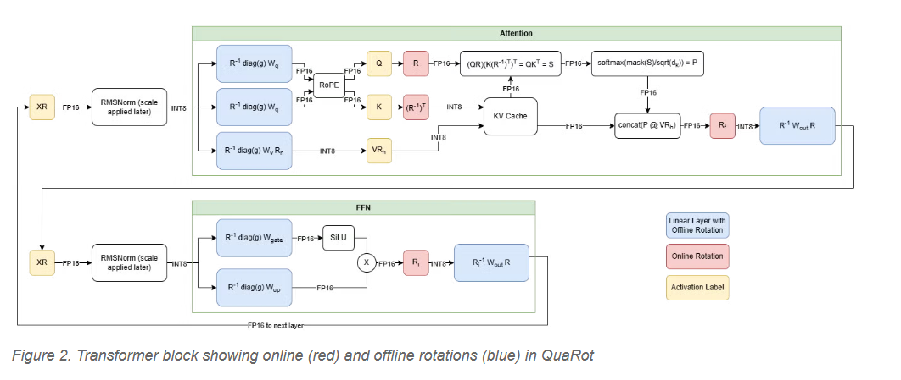

# day12
- hadamard core
- what is hadamard matrix 
  - matrix 裡面都是 1 or -1
  - 任意兩個 row 互相正交 ( orthogonal ). 

ref: https://en.wikipedia.org/wiki/Hadamard_matrix#:~:text=In%20mathematics%2C%20an%20Hadamard%20matrix%2C%20named%20after,hold%20for%20columns%20as%20well%20as%20rows.

ref: https://ocw.nycu.edu.tw/?post_type=course_page&p=34624  

- simple quantize vs hadmard quantize
  - simple

  - hadamard 

- 結果

    - dimension 越大, 越極端的 outlier, 旋轉帶來的量化更明顯
  
- 背景: quarot, spin quant, flashatten3????? 都會用到 FWHT, 主要用途是透過 hadamard matrix 做旋轉, 保留 outlier, 讓 quantize 後 的 ppl 降低. 
https://neurips.cc/virtual/2024/poster/94328





- fwht: (fast walsh-hadamard transform), 類似 fft, 但不用複雜數, 只有 +/-, 主要用在 hadamard matrix 的運算. O(n log n)
  - 
  - example: 

- hadamard_transform_cuda 
```
// a 4x2, b 2x2, c 2x2
template <torch::ScalarType dtype>
__device__ __forceinline__ void mma_m16_n8_k16_b16_b16_b16_noacc(b32 a0, b32 a1, b32 a2, b32 a3, b32 b0, b32 b1, b32& c0, b32& c1){
    static_assert(dtype == torch::ScalarType::Half || dtype == torch::ScalarType::BFloat16);
    // d, a, b, c
    b32 zero = 0;
    if constexpr(dtype == torch::ScalarType::Half) {
        asm (
            "mma.sync.aligned.m16n8k16.row.col.f16.f16.f16.f16 "
            "{%0, %1}, {%2, %3, %4, %5}, {%6, %7}, {%8, %9};\n\t"
            : "=r"(c0), "=r"(c1) : "r"(a0), "r"(a1), "r"(a2), "r"(a3), "r"(b0), "r"(b1), "r"(zero), "r"(zero)
        );
    } else {
        b32 temp0, temp1, temp2, temp3;
        asm (
            "mma.sync.aligned.m16n8k16.row.col.f32.bf16.bf16.f32 "
            "{%0, %1, %2, %3}, {%4, %5, %6, %7}, {%8, %9}, {%10, %11, %12, %13};\n\t"
            : "=r"(temp0), "=r"(temp1), "=r"(temp2), "=r"(temp3) : "r"(a0), "r"(a1), "r"(a2), "r"(a3), "r"(b0), "r"(b1), "r"(zero), "r"(zero), "r"(zero), "r"(zero)
        );
        asm ("cvt.rn.bf16x2.f32 %0, %1, %2;\n\t" : "=r"(c0) : "r"(temp1), "r"(temp0));
        asm ("cvt.rn.bf16x2.f32 %0, %1, %2;\n\t" : "=r"(c1) : "r"(temp3), "r"(temp2));
    }
}

// a 4x2, b 4x2, c 4x2
template <torch::ScalarType dtype>
__device__ __forceinline__ void mma_m16_n16_k16_b16_b16_b16_noacc(b32 a0, b32 a1, b32 a2, b32 a3, b32 b0, b32 b1, b32 b2, b32 b3, b32& c0, b32& c1, b32& c2, b32& c3){
    mma_m16_n8_k16_b16_b16_b16_noacc<dtype>(a0, a1, a2, a3, b0, b1, c0, c1);
    mma_m16_n8_k16_b16_b16_b16_noacc<dtype>(a0, a1, a2, a3, b2, b3, c2, c3);
}

__device__ __forceinline__ void matrix_transpose_m8_n8_b16_inplace(b32& a0) {
    asm (
        "movmatrix.sync.aligned.m8n8.trans.b16 "
        "%0, %1;\n\t"
        : "=r"(a0) : "r"(a0)
    );
}
```