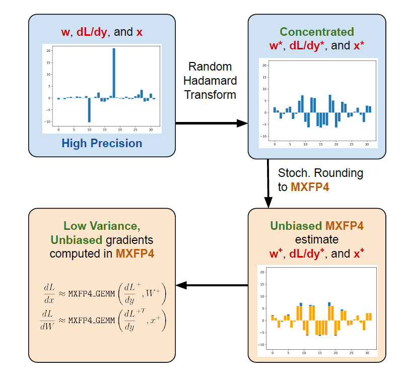
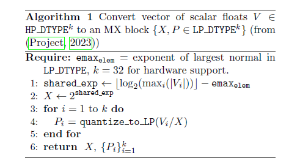
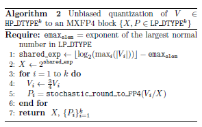
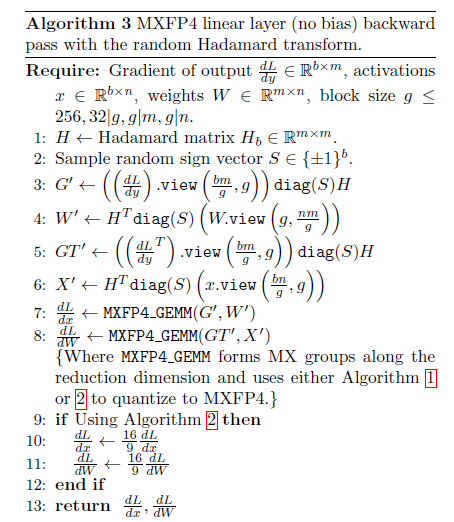
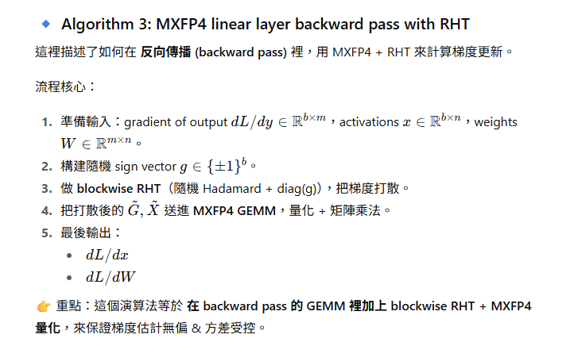
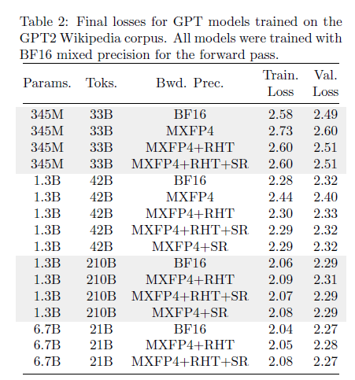

# day13 
## paper reading
- training LLMs with MXFP4 ( https://arxiv.org/abs/2502.20586 )

## Introduction  
- directly using `MXFP4` instead of `BF16` during training significantlyy degrades model quality.
- MXFP4 GEMM faster 2x than FP8 gregrade. 
- key insight: 
  - unbiased gradient estimate with `stochastic rounding`, more accurate. 
  - random Hadamard transform, threat outliters.
  - using 0.5x flops in mxfp4 thanl fp8. 
  - fp8 speedup > 1.3x , 
  - bp16 speedup 1.7x  during backpropagation.

- why using FP4 to training ?
    - pros: save memory, speed up computation👌
    - cons: low precision, small range
- why MX ( microscaing ) FP4 ?
    - pros: larger range, better precision, hardware friendly👌
    - cons: more complex implementation
    - using `int8` be scale `s`, 8 bit / 32 = 0.25 bits per entry, so every number using 4.25bit

- tradition quantize method used fp32/fp16 been scale factor. 
- MXFP4: using 2^x been scale factor.

## algo 1

- algo 1 主要是要找到block 裡面的 scale, 找的方式如上方
1. 先找到 block 裡面的最大 value, 在用 log2 找到 max value 的 exponent. 
2. 上方找到的 exponent - 2 (fp4 最大 exp == 2, 因為fp4 exp 只用 2bit)
3. 第四行會把 block 裡面每個 value 都 除以 2^shared_exp
## algo 2

- 目標 會是要讓 quantize 之後的 value, 在 fp4 裡面平均分布
- dithering 
- 解決 algo1 的 unbiased 問題 
    - reduce scale. x * 3/4 　( 因為 fp4 最大 value 有可能會介於 6 ~ 8 之間, 這樣就會有機率 round 到 8, 8 是 overflow 所以會需要把 value縮小成 6/8 = 3/4) 
## algo 3

- 使用 random hadamard transform 可以把 outlier 抹平, 之後在用 逆矩陣 轉回來.

## Related Work  

## Method  
https://github.com/amazon-science/mxfp4-llm

- paper 是用 https://github.com/microsoft/microxcaling/tree/7bc41952de394f5cc5e782baf132e7c7542eb4e4 用 軟體模擬 mxfp4. 如果用 硬體支援 mxfp4 應該可以更塊
## Experiments and Results  

- 從結果來看 可以看到 mxfp4 在 bp16 的 loss 已經很接近了
## Conclusion  
- 之後會想試看看 rtx5090, b200模擬 mxfp4 是不是 比 microxcaling 還要快.