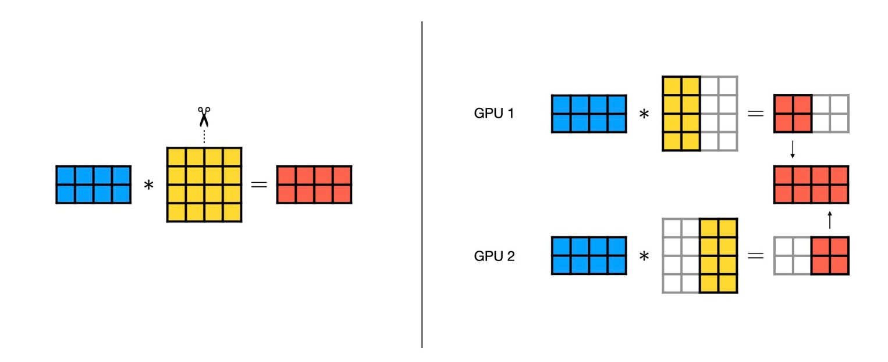
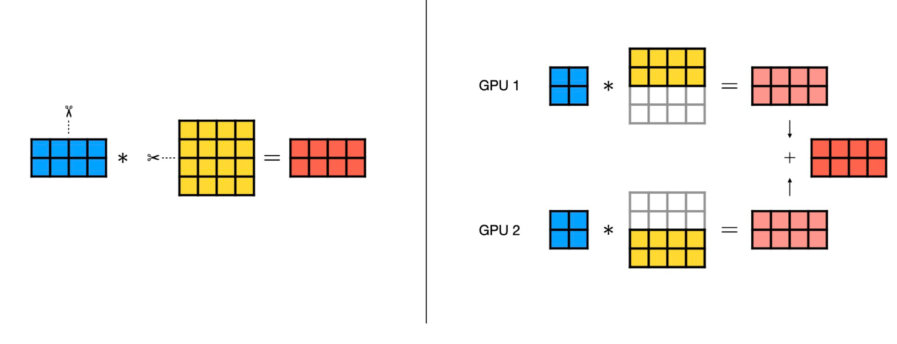
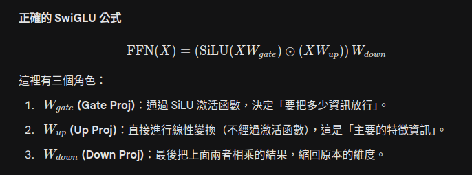

# nano vllm 
- [x] 關於 weight 切分還不是很懂 明天在看
- [ ] scheduler ? 
- [ ] kv cache manager?
# Tensor parallel
- tp shared: 切分完的大小. 
- 在 nano-vllm 切分邏輯都集中在 linear.py
```python
        LinearBase
            |
            | 繼承
            v
ReplicatedLinear/ColumnParallelLinear/rowParallelLinear
            |
            | 繼承
            v
MergedColumnParallel/QKVParallelLinear
```
  - `LinearBase` 會對tensor 做切分
  - `qkvparallel` 把多個 linear 的 weight 先合併 再做 切分, 另外 init 也有多 `num_head`/`kvhead` 的參數
  - `mergeColumnParallel` : 把多個 linear 的 weight 先合併 再做 切分
  - `ColumnParallelLinear`: 切分後的 tensor 去紀錄 offset
  - `RowParallelLinear`: 會針對 row 切分, 用途主要是 attention output projection , mlp down projection
## ReplicatedLinear

## ColumnParallelLinear

  - 使用時機: tensor 一般都是 [in_dim, out_dim], 當 out_dim 很大就很適合, 並且rank 算出來結果只需要 concat就好 不用另外做 reduce (通知其他worker gpu.)
```python
import numpy as np

# 假設數據
X = np.random.rand(2, 4)       # 輸入 (Batch=2, In=4)
W = np.random.rand(4, 6)       # 權重 (In=4, Out=6)

# --- 模擬 Column Parallel ---
# 切分權重 (切 Columns)
W1 = W[:, :3]  # 左半邊 (4, 3)
W2 = W[:, 3:]  # 右半邊 (4, 3)

# 各自運算 (每個 GPU 都有完整的 X)
Y1 = np.dot(X, W1)  # 結果 (2, 3)
Y2 = np.dot(X, W2)  # 結果 (2, 3)

# 合併結果 (左右黏起來)
Y_parallel = np.concatenate([Y1, Y2], axis=1)  # (2, 6)

```

- RowParallelLinear 

- 使用時機: input 已經是切分過
- 一定要做 all-reduce(sum). 
- 實際用在:
  - attention output projection (o_proj)
  - MLP down projection (down_proj)
```python
# --- 模擬 Row Parallel ---
# 切分權重 (切 Rows)
W_up = W[:2, :]   # 上半部 (2, 6)
W_down = W[2:, :] # 下半部 (2, 6)

# 切分輸入 (因為權重橫切了，輸入的 Feature 維度也要對應切開)
X_left = X[:, :2]  # 輸入的前半特徵
X_right = X[:, 2:] # 輸入的後半特徵

# 各自運算
Y1_partial = np.dot(X_left, W_up)    # (2, 6) 這只是部分和
Y2_partial = np.dot(X_right, W_down) # (2, 6) 這也是部分和

# 合併結果 (加總 All-Reduce)
Y_parallel = Y1_partial + Y2_partial

print("Row Parallel 結果一致性:", np.allclose(np.dot(X, W), Y_parallel))
```

## MergedColumnParallelLinear ＆＆ QKVParallelLin
會把矩陣合併起來一起算, e.g., wq, wk, wv 合併. 
- 沒有效率的方法
input * wq = q;
input * wk = k;
input * wv = v; 
> 會 launch 3 次 gemm kernel. 
- merge 
input * [wq, wk, wv] = q,k,v 算完在切分

- mlp 也會用到


> w gate 跟 w up 可以合併, 可以避免 launch kernel 的開銷.
# reference 
https://blog.csdn.net/m0_63372012/article/details/140800794

   https://lightning.ai/docs/fabric/2.4.0/advanced/model_parallel/tp.html

https://zhuanlan.zhihu.com/p/626008269

https://zhuanlan.zhihu.com/p/705054687