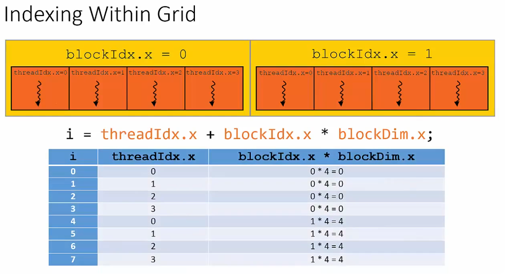
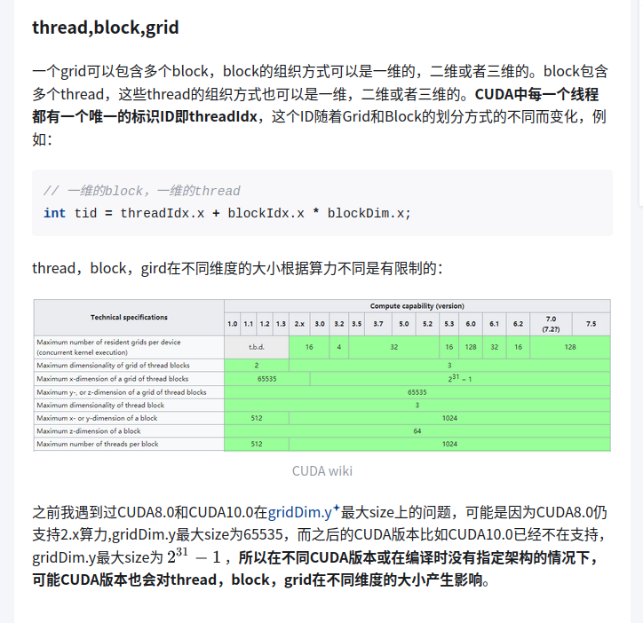

# day2
- 好用網站(https://leetgpu.com/playground) 沒有gpu 的人可以使用
# thread, block, grid
- `thread` : 最小的執行單位
- `Warp`: 32 條 thread 會組成一個 warp.
- `block` : 由 1 個 或 多個 warp 組成, block 的大小 可以透過 `<<<gridDim, blockDim>>>` blockDim 來決定.
- `SM (Streaming Multiprocessor)`: 可以想像成 cpu core, 每個 sm 會分發工作給多個 block (1~8), 並在內部排程. 
  - 前面有提到  `block`  size 可以指定, cuda 有`cudaOccupancyMaxPotentialBlockSize` 可以估計最適合目前硬體的 block size. 
- `Grid` : 由許多 blocks 排列成 1D / 2D / 3D 形狀；尺寸由 gridDim.{x,y,z} 指定.

- 記法: `Grid` → `Block` → `Warp` → `Thread`, SM 負責 block 跟 warp 的運作
# 實際用法
- 下方影片的screen shot 用 `threadIdx.x + blockIdx.x * blockDim.x` 來舉例子. 假設今天要 launch 一個 kernel. data 的 index 需要依賴 你指定的 dim size 去決定 index 的 value.
- 已下圖的例子, threadIdx 都是 0~3, blockIdx 是 0 ~1, `blockDim` 是使用者去決定.

- 下面是 `vector Add`, 使用者透過 `cudamalloc `決定 a,b,c 的 size, 跟 前面提到 index 的算法, 就可以簡單起一個 vector add 的 kernel. 
- code snippet
```
__global__
void vecAddGPU(const float* a, const float* b, float* c, size_t n) {
    size_t idx = blockIdx.x * blockDim.x + threadIdx.x;
    if (idx < n) c[idx] = a[idx] + b[idx];
}
```
# 今日進度
- 先簡單寫一個 vector add 比較 serial 跟 parallel 的正確性. 

# 明天進度
- [ ] 比較 個別 block, thread, grid 下的 速度差異
# ref
https://zhuanlan.zhihu.com/p/123170285
https://www.youtube.com/watch?v=cRY5utouJzQ