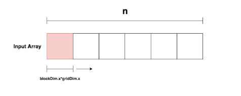

# day4
## Target
- extend day3 profiling, analyze, and find bottlenecks.
- hw: rtx 1070 8gb (compute capability 6.1)
- using `nv-nsight-cu-cli` to profile and analyze the kernel performance.
- using cuda api to check occupancy and other performance metrics.
## what is occupancy?
- occupancy is the ratio of active warps to the maximum number of warps supported on a multiprocessor. e.g., if a multiprocessor can support 64 warps and there are 32 active warps, the occupancy is 50%.
- occupancy is important because it affects the performance of the kernel. higher occupancy means more warps are available to execute, which can hide memory latency and improve throughput. 
### example of occupancy
- The SM can support a maximum of `64 warps = 2048 threads`, you only launch `4 warps = 128 threads`, the occupancy is 4/64 = 6.25%.
- why need to over 4 warps? because the SM needs to switch between warps to hide memory latency, if there are not enough warps, the SM will be idle waiting for memory operations to complete. 
  - one fma delay is `4 cycles`, so if there are not enough warps, the SM will be idle for 4 cycles waiting for memory operations to complete.
  - One global load delay is `200 cycles`, so if there are not enough warps, the SM will be idle for `200 cycles` waiting for memory operations to complete.
  - if only launch 4 warp, when other warps are waiting for memory operations to complete, the SM will be idle for a long time, which can `significantly reduce` the performance of the kernel.
### how to check it via Profiler
- Theoretical occupancy can be calculated using the block, register, shared memory, and warp size.
- meric we need to care. 


| Metric Name | Description |
|-------------|-------------|
|eligible_warps_per_cycle | The number of warps that are eligible to issue instructions per cycle. A `higher value` indicates better warp scheduling and utilization. |
|issue_slot_utilization | The percentage of issue slots that are utilized. A `higher value` indicates better utilization of the GPU's execution resources. |
|achieved_occupancy | The ratio of active warps to the maximum number of warps supported on a multiprocessor. A `higher value` indicates better utilization of the GPU's resources. |


- The achieved occupancy can be calculated using the number of `active warps and the maximum number of warps` supported on a multiprocessor.
    - if the Achieved is less than the Theoretical, it means that the kernel is not utilizing the available resources efficiently. maybe can increase the `gridDim` or `blockDim` to increase the number of active warps.
    - In Nsight compute, you can check the `Warp issue Efficiency` and check `No Eligible` and `Not Selected`. 
```c++
#include <cuda_runtime.h>
#include <cstdio>
#include <cstdlib>
#include <chrono>

constexpr int N = 1 << 24;           // 16 M elements
constexpr int STRIDE = 128;          // 跨 stride 造成 L2 Miss，拉長延遲

// ───────────────────────────────────────────────
// GPU Kernel：每個 thread 反覆做 global-load 以放大記憶體延遲
__global__ void latencyKernel(float *out, const float *in, int n, int stride) {
    int tid = blockIdx.x * blockDim.x + threadIdx.x;
    float acc = 0.f;
    for (int i = tid; i < n; i += stride)
        acc += in[i];
    // 把結果寫回，避免編譯器把迴圈優化掉
    if (tid < 1024)
	    out[tid] = acc;
}

int main(int argc, char **argv) {
    if (argc < 2) { printf("Usage: %s <blockDim.x>\n", argv[0]); return 0; }
    int block = atoi(argv[1]);
    int grid  = (N + block - 1) / block;

    // ── Step 0：計算「理論佔用度」
    cudaDeviceProp prop;  cudaGetDeviceProperties(&prop, 0);

    int blocksPerSM, activeWarps, maxWarps = prop.maxThreadsPerMultiProcessor / prop.warpSize;
    cudaOccupancyMaxActiveBlocksPerMultiprocessor(&blocksPerSM,
                                                  latencyKernel,
                                                  block, 0);
    activeWarps = blocksPerSM * block / prop.warpSize;
    printf("=== Launch %d-thread block ===\n", block);
    printf("Theoretical occupancy : %2.1f %%  (%d / %d warps per SM)\n",
           100.0 * activeWarps / maxWarps, activeWarps, maxWarps);

    // ── Step 1：配置記憶體
    float *d_in, *d_out;
    cudaMalloc(&d_in,  N * sizeof(float));
    cudaMalloc(&d_out, 1024 * sizeof(float));
    cudaMemset(d_in,  0, N * sizeof(float));
    cudaMemset(d_out, 0, 1024 * sizeof(float));

    // ── Step 2：時間量測
    cudaEvent_t t0, t1;  cudaEventCreate(&t0);  cudaEventCreate(&t1);
    cudaEventRecord(t0);

    latencyKernel<<<grid, block>>>(d_out, d_in, N, STRIDE);

    cudaEventRecord(t1);  cudaEventSynchronize(t1);
    float ms = 0;  cudaEventElapsedTime(&ms, t0, t1);
    printf("Elapsed time         : %.3f ms\n\n", ms);

    // ── Step 3：收尾
    cudaFree(d_in); cudaFree(d_out);
    return 0;
}

``` 

- result:
```bash
nigel_wang@ai-pc:/mnt/data/nigel_wang/cuda_test$ ./latency_hiding 32
=== Launch 32-thread block ===
Theoretical occupancy : 50.0 %  (32 / 64 warps per SM)
Elapsed time         : 13515.183 ms

nigel_wang@ai-pc:/mnt/data/nigel_wang/cuda_test$ ./latency_hiding 256
=== Launch 256-thread block ===
Theoretical occupancy : 100.0 %  (64 / 64 warps per SM)
Elapsed time         : 7055.702 ms

```
- using `nsight compute` to check the performance metrics.
```
$ sudo /usr/local/NVIDIA-Nsight-Compute/nv-nsight-cu-cli --metrics smsp__active_warps_avg,smsp__eligible_warps_avg,smsp__warp_stall_not_selected_pct   ./latency_hiding 256

```
- generate nvprof report 
```
# ① 低佔用：32 threads / block
nvprof  --metrics eligible_warps_per_cycle,issue_slot_utilization,achieved_occupancy \
        --csv --log-file lh32.csv        \
        -o lh32.nvprof  ./latency_hiding 32

# ② 中佔用：256 threads / block
nvprof  --metrics eligible_warps_per_cycle,issue_slot_utilization,achieved_occupancy \
        --csv --log-file lh256.csv       \
        -o lh256.nvprof ./latency_hiding 256

# using nvvp to visualize the report.
nvvp lh32.nvprof & 
# cli 
nvprof --import lh32.nvprof --print-summary | grep -E "eligible|issue_slot|achieved"
nvprof --import lh256.nvprof --print-summary | grep -E "eligible|issue_slot|achieved"
```


## tips

- often using `N+block -1` / `block` to calculate the grid size, this is to ensure that the last block will cover the remaining elements if `N` is not a multiple of `block`.
- `gridDim.x * blockDim.x` is the total number of threads in the grid, no using fixed stride, the performance will be better.

- using `gridDim.x * blockDim.x` to calculate the stride, this will ensure that all threads in the grid will be used, and the performance will be better.
```c++
int grid  = (N + block - 1) / block;

for (int i = tid; i<n ; i +=  gridDim.x * blockDim.x)

```

- ref: 
- https://developer.nvidia.com/blog/cuda-pro-tip-write-flexible-kernels-grid-stride-loops/?utm_source=chatgpt.com
- https://victorleungtw.medium.com/accelerating-data-processing-with-grid-stride-loops-in-cuda-8adc810d188d
- https://alexminnaar.com/2019/08/02/grid-stride-loops.html