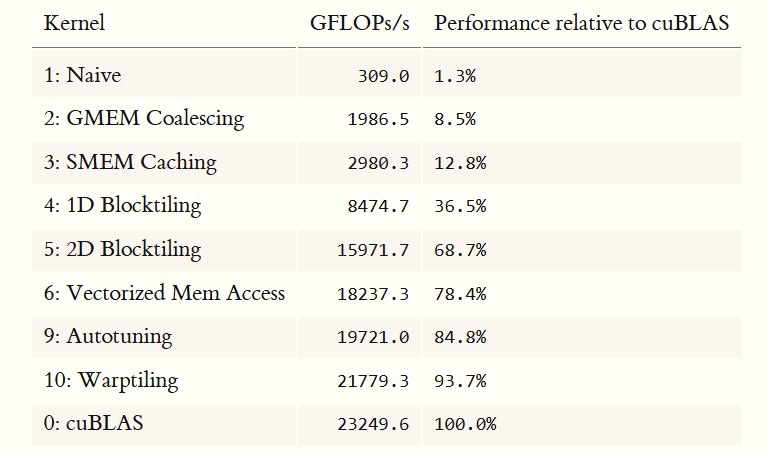
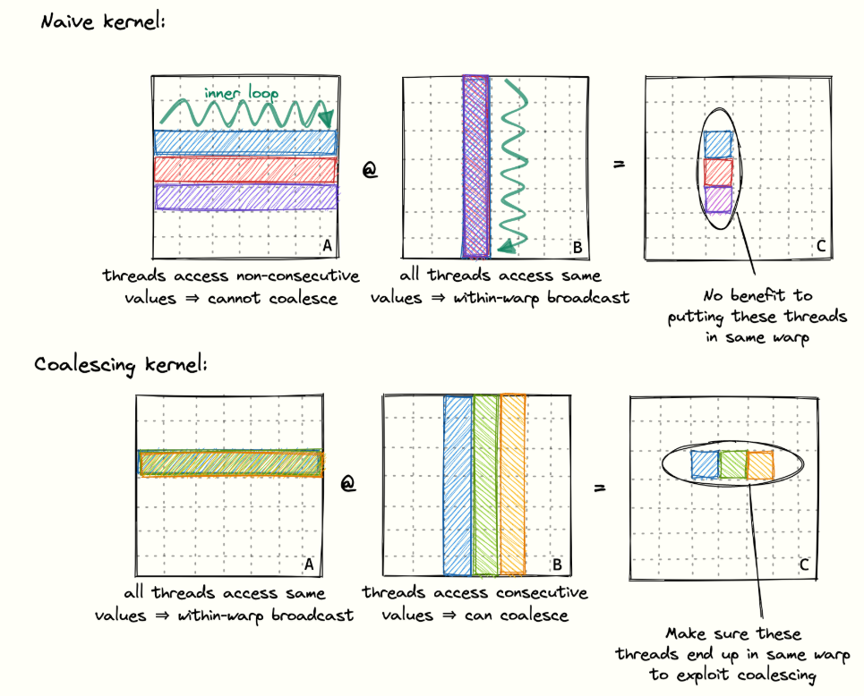

# day5
# target
read `https://siboehm.com/articles/22/CUDA-MMM`
- compare [1] and [2] approach.


# memory Coalscing 
- Because of my gpu is rtx 1070, the arch is sm_61, if using `CUDA-MMM`, need some patch to make it work.
- `sm_61` is not supported `CUBLAS_COMPUTE_32F`.
```
diff --git a/src/runner.cu b/src/runner.cu
index 4c0142d..6c58e1a 100644
--- a/src/runner.cu
+++ b/src/runner.cu
@@ -4,7 +4,7 @@
 #include <cstdio>
 #include <fstream>
 #include <iomanip>
-
+#include <cublasLt.h>
 float get_sec() {
   struct timeval time;
   gettimeofday(&time, NULL);
@@ -126,11 +126,21 @@ void runCublasFP32(cublasHandle_t handle, int M, int N, int K, float alpha,
   // cuBLAS uses column-major order. So we change the order of our row-major A &
   // B, since (B^T*A^T)^T = (A*B)
   // This runs cuBLAS in full fp32 mode
-  cublasGemmEx(handle, CUBLAS_OP_N, CUBLAS_OP_N, N, M, K, &alpha, B, CUDA_R_32F,
-               N, A, CUDA_R_32F, K, &beta, C, CUDA_R_32F, N, CUBLAS_COMPUTE_32F,
-               CUBLAS_GEMM_DEFAULT_TENSOR_OP);
-}
+  //cublasGemmEx(handle, CUBLAS_OP_N, CUBLAS_OP_N, N, M, K, &alpha, B, CUDA_R_32F,
+  //             N, A, CUDA_R_32F, K, &beta, C, CUDA_R_32F, N, CUBLAS_COMPUTE_32F,
+  //             CUBLAS_GEMM_DEFAULT_TENSOR_OP);
+    constexpr auto algo  = CUBLAS_GEMM_DEFAULT; // 無 _TENSOR_OP
+    constexpr auto ctype = CUDA_R_32F;
+    cublasGemmEx(handle,CUBLAS_OP_N,CUBLAS_OP_N,
+                 N,M,K,&alpha,
+                 B,CUDA_R_32F,N,
+                 A,CUDA_R_32F,K,
+                 &beta,
+                 C,CUDA_R_32F,N,
+                 ctype,algo);

```

-  `CUDA-MMM` can compare with `cublas` and `cutlass` correctness and  performance.
-  do `sgemm 0` or `sgemm 1` to compare the performance. 
- About `memory coalescing`, need to make is `column major` to the memory is contiguous in memory. 



- the difference between `native` and `memory coleasing`. 
- naive
```
__global__ void sgemm_naive(int M, int N, int K, float alpha, const float *A,
                            const float *B, float beta, float *C) {
  const uint x = blockIdx.x * blockDim.x + threadIdx.x;
  const uint y = blockIdx.y * blockDim.y + threadIdx.y;

  // if statement is necessary to make things work under tile quantization
  if (x < M && y < N) {
    float tmp = 0.0;
    #pragma unroll 4
    for (int i = 0; i < K; ++i) {
      tmp += A[x * K + i] * B[i * N + y];
    	//if (x < 4 && y < 4 && blockIdx.x==0 && blockIdx.y==0)
        //printf("tid=%3d row=%2d col=%2d  A[%ld]  B[%ld]\n",
        //       threadIdx.x,x,y,x*K+i, i*N+y);

    }
    // C = α*(A@B)+β*C
    C[x * N + y] = alpha * tmp + beta * C[x * N + y];
  }
}

```
- memory coalescing
```
template <const uint BLOCKSIZE>
__global__ void sgemm_global_mem_coalesce(int M, int N, int K, float alpha,
                                          const float *A, const float *B,
                                          float beta, float *C) {
  const int cRow = blockIdx.x * BLOCKSIZE + (threadIdx.x / BLOCKSIZE);
  const int cCol = blockIdx.y * BLOCKSIZE + (threadIdx.x % BLOCKSIZE);
//const uint cRo = blockIdx.x * blockDim.x + threadIdx.x;
//const uint cCo = blockIdx.y * blockDim.y + threadIdx.y;

  // if statement is necessary to make things work under tile quantization
  if (cRow < M && cCol < N) {
    float tmp = 0.0;
    for (int i = 0; i < K; ++i) {
      tmp += A[cRow * K + i] * B[i * N + cCol];
    }
    C[cRow * N + cCol] = alpha * tmp + beta * C[cRow * N + cCol];
  }
}

```
# performance 
```bash

# naive
dimensions(m=n=k) 128, alpha: 0.5, beta: 3
Average elapsed time: (0.000098) s, performance: (   42.6) GFLOPS. size: (128).
dimensions(m=n=k) 256, alpha: 0.5, beta: 3
Average elapsed time: (0.000688) s, performance: (   48.8) GFLOPS. size: (256).
dimensions(m=n=k) 512, alpha: 0.5, beta: 3
Average elapsed time: (0.005357) s, performance: (   50.1) GFLOPS. size: (512).
dimensions(m=n=k) 1024, alpha: 0.5, beta: 3
Average elapsed time: (0.041117) s, performance: (   52.2) GFLOPS. size: (1024).
dimensions(m=n=k) 2048, alpha: 0.5, beta: 3
Average elapsed time: (0.310197) s, performance: (   55.4) GFLOPS. size: (2048).


# memory coalescing
Running kernel 2 on device 0.
Max size: 4096
dimensions(m=n=k) 128, alpha: 0.5, beta: 3
Average elapsed time: (0.000017) s, performance: (  248.7) GFLOPS. size: (128).
dimensions(m=n=k) 256, alpha: 0.5, beta: 3
Average elapsed time: (0.000082) s, performance: (  406.7) GFLOPS. size: (256).
dimensions(m=n=k) 512, alpha: 0.5, beta: 3
Average elapsed time: (0.000536) s, performance: (  501.0) GFLOPS. size: (512).
dimensions(m=n=k) 1024, alpha: 0.5, beta: 3
Average elapsed time: (0.005251) s, performance: (  408.9) GFLOPS. size: (1024).
dimensions(m=n=k) 2048, alpha: 0.5, beta: 3
Average elapsed time: (0.042102) s, performance: (  408.1) GFLOPS. size: (2048).
dimensions(m=n=k) 4096, alpha: 0.5, beta: 3
Average elapsed time: (0.340573) s, performance: (  403.6) GFLOPS. size: (4096).

```
# conclusion
- the row is fixed, the column is contiguous in memory. gpu can load 32B/64B/128B in one time. 32*float = 128B. so if its contiguous in memory, it only can load memory once.
