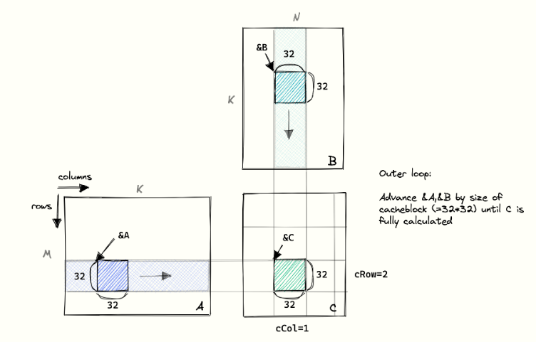

- [target](#target)
- [what you learn](#what-you-learn)
- [smem](#smem)
- [ref](#ref)
# target
- learn how to use shared memory in CUDA to improve performance.
 
# what you learn
- using `--ptxas-options=-v` to check the shared memory usage. 
- using `__shared__` to declare shared memory in kernel. 
# smem
- steps to use shared memory in CUDA 
```c++
// declare shared memory in kernel
 __shared__ float As[BLOCKSIZE * BLOCKSIZE];
  __shared__ float Bs[BLOCKSIZE * BLOCKSIZE];
```
- before do k times of dot product, we need to check the A and B offsete. 
```c++
  // advance pointers to the starting positions
  A += cRow * BLOCKSIZE * N;                    // row=cRow, col=0
  B += cCol * BLOCKSIZE;                        // row=0, col=cCol
  C += cRow * BLOCKSIZE * N + cCol * BLOCKSIZE; // row=cRow, col=cCol

```
- in k loop, every time As will move via x and Bs will move via y, 


```c++

  As[threadRow * BLOCKSIZE + threadCol] = A[threadRow * K + threadCol];
    Bs[threadRow * BLOCKSIZE + threadCol] = B[threadRow * N + threadCol];

```

- in k loops the memory is colased. 
  - As: `threadRow` can't change, dotIdx is continous. 
  - Bs: `threadCol` is continous, and `dotIdx` can added `BLOCKSIZE` every loop.
```
// execute the dotproduct on the currently cached block
    for (int dotIdx = 0; dotIdx < BLOCKSIZE; ++dotIdx) {
      tmp += As[threadRow * BLOCKSIZE + dotIdx] * Bs[dotIdx * BLOCKSIZE + threadCol];
    }
```
---
```c++
#include <algorithm>
#include <cstdio>
#include <cstdlib>
#include <cublas_v2.h>
#include <cuda_runtime.h>

#define CEIL_DIV(M, N) (((M) + (N)-1) / (N))

template <const int BLOCKSIZE>
__global__ void sgemm_shared_mem_block(int M, int N, int K, float alpha,
                                       const float *A, const float *B,
                                       float beta, float *C) {
  // the output block that we want to compute in this threadblock
  const uint cRow = blockIdx.x;
  const uint cCol = blockIdx.y;

  // allocate buffer for current block in fast shared mem
  // shared mem is shared between all threads in a block
  __shared__ float As[BLOCKSIZE * BLOCKSIZE];
  __shared__ float Bs[BLOCKSIZE * BLOCKSIZE];

  // the inner row & col that we're accessing in this thread
  const uint threadCol = threadIdx.x % BLOCKSIZE;
  const uint threadRow = threadIdx.x / BLOCKSIZE;

  // advance pointers to the starting positions
  A += cRow * BLOCKSIZE * N;                    // row=cRow, col=0
  B += cCol * BLOCKSIZE;                        // row=0, col=cCol
  C += cRow * BLOCKSIZE * N + cCol * BLOCKSIZE; // row=cRow, col=cCol

  float tmp = 0.0;
  for (int bkIdx = 0; bkIdx < K; bkIdx += BLOCKSIZE) {
    // Have each thread load one of the elements in A & B
    // Make the threadCol (=threadIdx.x) the consecutive index
    // to allow global memory access coalescing
    As[threadRow * BLOCKSIZE + threadCol] = A[threadRow * K + threadCol];
    Bs[threadRow * BLOCKSIZE + threadCol] = B[threadRow * N + threadCol];

    // block threads in this block until cache is fully populated
    __syncthreads();
    A += BLOCKSIZE;
    B += BLOCKSIZE * N;

    // execute the dotproduct on the currently cached block
    for (int dotIdx = 0; dotIdx < BLOCKSIZE; ++dotIdx) {
      tmp += As[threadRow * BLOCKSIZE + dotIdx] * Bs[dotIdx * BLOCKSIZE + threadCol];
    }
    // need to sync again at the end, to avoid faster threads
    // fetching the next block into the cache before slower threads are done
    __syncthreads();
  }
  C[threadRow * N + threadCol] =
      alpha * tmp + beta * C[threadRow * N + threadCol];
}

```
# ref

https://siboehm.com/articles/22/CUDA-MMM