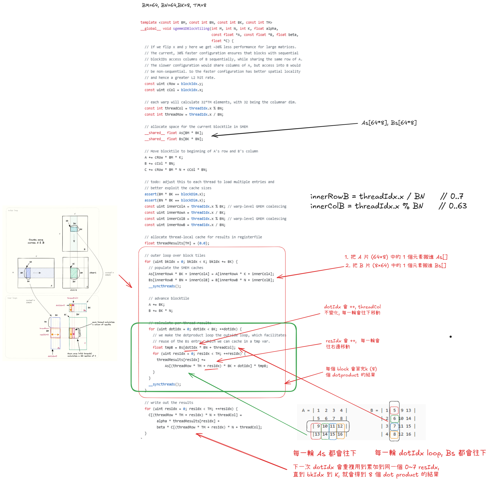

# day 7 
- [day 7](#day-7)
  - [kernel4](#kernel4)
## kernel4
- kernel 4 主要是針對 kernel 3 做優化, sharemem 轉換成 1d 在 load shared mem (`ld.shared.f32`) 時候 會更有效率
- trace kernel 4 的 source code
- 使用 `excalidraw` 來畫出 kernel 4 的執行流程圖

---


--- 

- 最難懂的地方應該是綠色框框
- 每次 As 會 load k (8) 個mem, Bs 是 load 一個 mem, 會把每一次的 mult 結果依序存到  `0~ TM(8)` 
- 下一輪 dotIdx 會做一樣的事情, 差別在A 的 row 會 +1, B 的 Row 也會 +1 
- 最後做完 `k `次 threadresults[0] ~ threadresults[7] 就會是 dot product 的結果.
```c++
for (uint dotIdx = 0; dotIdx < BK; ++dotIdx) {
      // we make the dotproduct loop the outside loop, which facilitates
      // reuse of the Bs entry, which we can cache in a tmp var.
      float tmpB = Bs[dotIdx * BN + threadCol];
      for (uint resIdx = 0; resIdx < TM; ++resIdx) {
        threadResults[resIdx] +=
            As[(threadRow * TM + resIdx) * BK + dotIdx] * tmpB;
      }
    }


```

