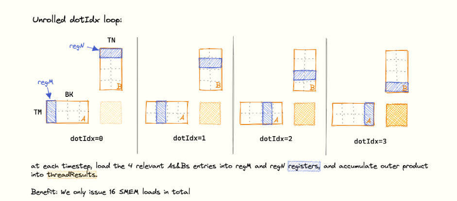

# day8
## 先比較 kernel 4 跟 kernel 5. 
|                      | Kernel 4 – **1 D Block-tiling**                    | Kernel 5 – **2 D Block-tiling**             |
| ---------------------- | -------------------------------------------------- | ------------------------------------------- |
| **每執行緒計算的 C 元素數**      | `TM = 8` ⇒ 1 × 8 直條                                | `TM × TN = 8 × 8 = 64` ⇒ 8 × 8 方格           |
| **使用的 SMEM 區塊形狀**      | 1 D（64 × 8）<br>只沿 *K* 方向切片                         | 2 D（64 × 8 + 8 × 64）<br>同時沿 *M*、*N* 方向切片    |
| **計算/記憶體（AI）提升**       | GMEM  K/32 / result<br>SMEM  ≈ 2 K / result        | GMEM  K/64 / result<br>SMEM  ≈ K/4 / result |
| **暫存區重用**              | 只重用 `B` 欄元素（`A` 每列仍重載）                             | 同時重用 `A` *列* 與 `B` *欄*，重用度大幅增加              |
| **暫存器壓力**              | 8 個累積暫存值                                           | 64 個累積暫存值（較高的寄存器佔用，降低部份 occupancy）          |


[1]: https://siboehm.com/articles/22/CUDA-MMM "How to Optimize a CUDA Matmul Kernel for cuBLAS-like Performance: a Worklog"


# kernel 5
- 主要增加 register 的使用量, 本來只用 8 個 smem, 暫存 b,
  現在增加到 64 個 smem, 暫存 a, b, 這樣可以減少 global memory 的存取次數.
- kernel 走法


- code snippet.
```c
  for (uint dotIdx = 0; dotIdx < BK; ++dotIdx) {
    // load relevant As & Bs entries into registers
    for (uint i = 0; i < TM; ++i) {
      regM[i] = As[(threadRow * TM + i) * BK + dotIdx];
    }
    for (uint i = 0; i < TN; ++i) {
      regN[i] = Bs[dotIdx * BN + threadCol * TN + i];
    }
```

- 結論 
  - 增加每個 thread 的 regs, 可以更接近 compute bound.
  - 缺點:Kernel 5 的 64 regs/thread 可能壓低 occupancy.
  - 可以用 `nvcc -arch=sm_65 -Xptxas -v -lineinfo my_kernel.cu` 來檢查寄存器使用情況. 