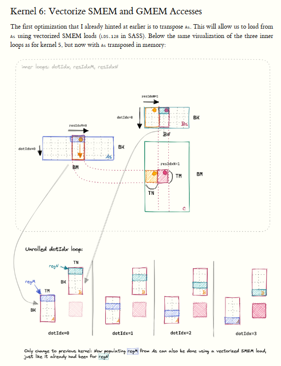
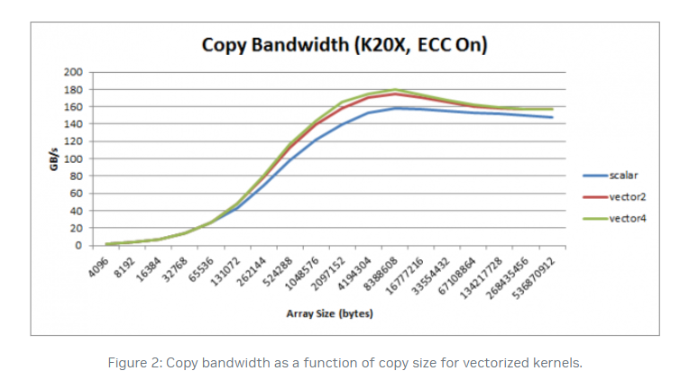

# day9
- after kernel 6 flops all is same with cublas, so i don't do profile. just learn the how to optimize cuda code. 
## study how to improve in kernel6.
- using vectorized memory access
ref: https://developer.nvidia.com/blog/cuda-pro-tip-increase-performance-with-vectorized-memory-access/
- the `kernel 6` using `vector datatypes` namely float4. 
- one cache line is 128bit, float 4 is 4*32 data onetime.
- below is ptx type. if you use different `vector datatype`, it can use diffenent `ptx code`

| 名稱              | 意義                             | 實際做的事                                                                              |
| --------------- | ------------------------------ | ---------------------------------------------------------------------------------- |
| **`LDG.E`**     | *LoaD Global, Element (32 b)*  | 從 global memory 取 **1 個 32‑bit word** 到暫存器。一般你用 `float` / `int` 讀取時就是這條。           |
| **`STG.E`**     | *STore Global, Element (32 b)* | 把 **1 個 32‑bit word** 寫回 global。                                                   |
| **`LDG.E.128`** | *LoaD Global, 128 bit vector*  | 一次抓 **4 個 32‑bit word（共 16 B）**。在 PTX 會看到 `ld.global.v4.f32` 或 `ld.global.v2.b64`。 |
| **`STG.E.128`** | *STore Global, 128 bit vector* | 一次寫 **16 B**。對應 `st.global.v4.f32` 等語法。                                            |


```c++
 // populate the SMEM caches
    // transpose A while loading it
    float4 tmp =
        reinterpret_cast<float4 *>(&A[innerRowA * K + innerColA * 4])[0];
    As[(innerColA * 4 + 0) * BM + innerRowA] = tmp.x;
    As[(innerColA * 4 + 1) * BM + innerRowA] = tmp.y;
    As[(innerColA * 4 + 2) * BM + innerRowA] = tmp.z;
    As[(innerColA * 4 + 3) * BM + innerRowA] = tmp.w;

```

- anothor approach , transpose A matrix make the memory is coalescing .
# conclusion
- if we use `float4` or other type, we can change load method. e.g., we can use the characteristic to do `transpose`.
- but the improvement is less than other method. 
- ref: https://developer.nvidia.com/blog/cuda-pro-tip-increase-performance-with-vectorized-memory-access/

